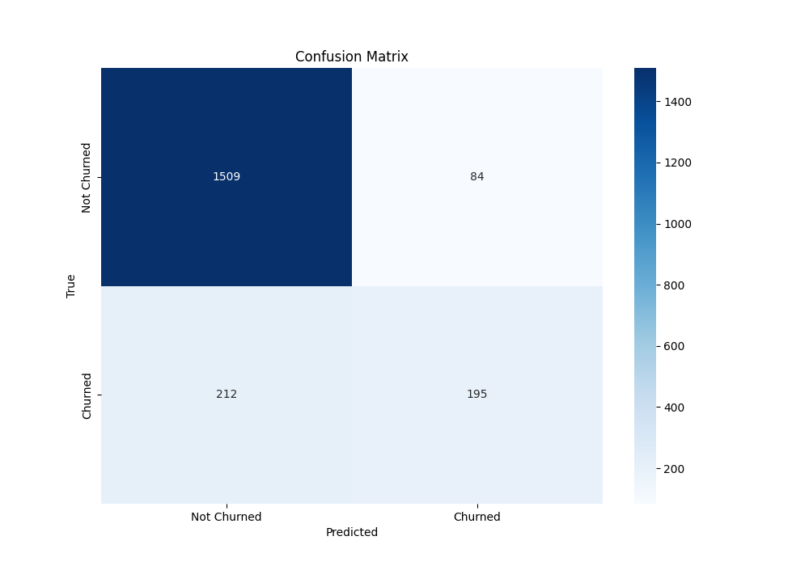

# Bank-Customer-Churn-analysis
Basic End to End Machine learning model using Scikit-learn to analyze Customer's churn rate and  predict whether a Customer will churn or not.

Deployed the model through python's [Streamlit](https://streamlit.io/) library with interactive web interface to enter the customer's information and get the result through a pre-trained ML model. 

## Confusion Matrix:

## Classification Report:
||Precision |    Recall|  F1-score|   Support|
|-----|-----|-----|-----|-----|
|False|       0.88|      0.95|      0.91|      1593|
|True   |0.70      |0.48      |0.57|       407|           
|Accuracy|                           ||0.85      |2000|
|Macro avg|       0.79     | 0.71|      0.74|      2000
weighted avg      | 0.84|      0.85|      0.84|      2000
